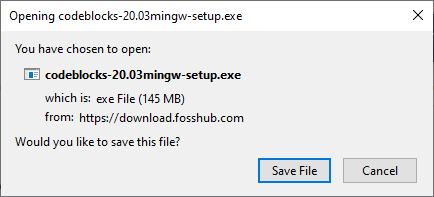
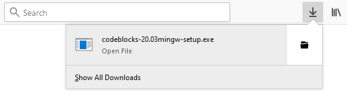
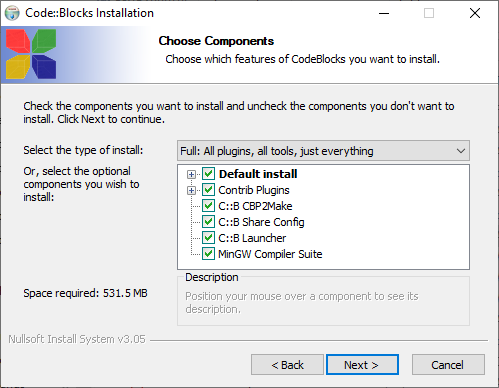
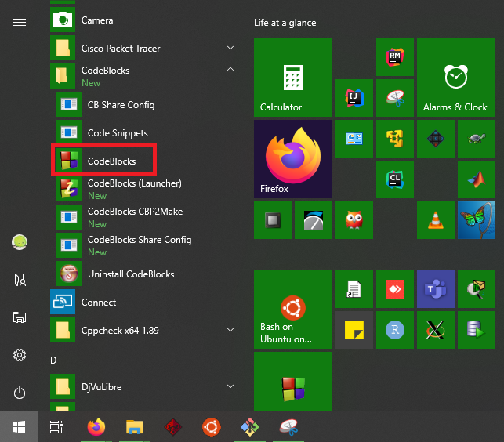
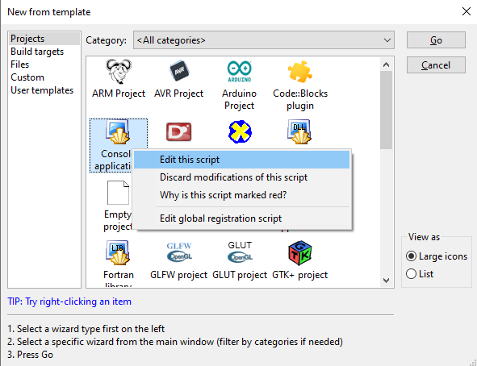
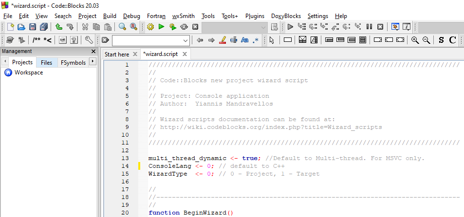
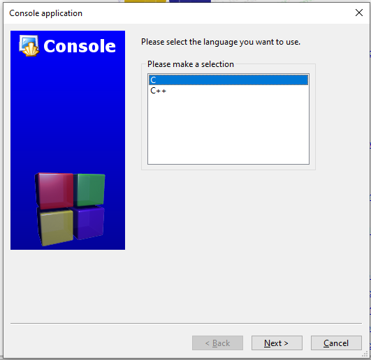
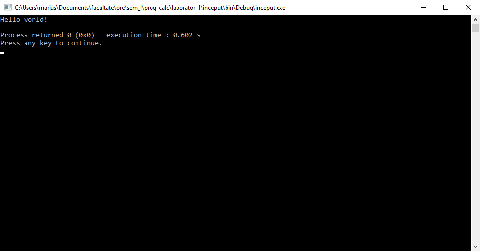

# Laboratorul 1

### ⚠ **Puneți cât mai multe întrebări! Nu există întrebări greșite.**

# Cuprins
## [Pregătirea mediului de lucru](#pregătirea-mediului-de-lucru-1)
## [Câteva programe simple](#câteva-programe-simple-1)
## [Exerciții](#exerciții-1)
## [Întrebări, erori și orice nu a fost acoperit deja](#întrebări-erori-diverse)
## [Resurse recomandate](#resurse-recomandate-1)

## Pregătirea mediului de lucru

Avem nevoie de un compilator pentru limbajul C și un editor de text. Puteți sări peste acest pas dacă aveți instalat Code::Blocks și vă funcționează un program de test și debugger-ul.

Pentru a simplifica procesul de instalare, este recomandat să folosiți [Code::Blocks](http://www.codeblocks.org/downloads/26).

Întrucât majoritatea dintre voi cel mai probabil aveți Windows, veți descărca executabilul `codeblocks-20.03mingw-setup.exe`, deoarece acesta include atât editorul de text, cât și compilatorul.

Aveți câteva indicații în imaginile de mai jos; dați click pe imagini pentru a le vedea la rezoluție mai mare.

Dacă nu aveți drepturi de admin, descărcați `codeblocks-20.03mingw-nosetup.zip`. Creați un folder nou, apoi extrageți arhiva în acel folder.

❕ *Dacă v-ați blocat sau aveți erori sau nu vă iese ceva, întrebați!*




Dacă folosiți Google Chrome, download-ul va apărea în bara de jos. La Firefox, e în dreapta sus:



Ideal ar fi să selectați o instalare completă. Dacă nu aveți suficient spațiu pe calculator, găsim soluții alternative.



Dacă ați instalat Code::Blocks mai demult, probabil aveți versiunea pe 32 de biți. Puteți să lăsați și versiunea veche sau puteți să o dezinstalați.

Desigur, puteți să folosiți ce aveți deja, nu sunt diferențe de interes pentru acest laborator între versiunile de Code::Blocks.

---

🚧 De adăugat: Pas instalare compilator.

---

După ce s-a terminat de instalat, va trebui să alegeți compilatorul: dați click pe `GNU GCC Compiler` și faceți click pe `Set as default`, apoi `OK`:


Când lansați Code::Blocks, folosiți fie shortcut-ul de pe Desktop, fie din meniu (mie, cel puțin, nu mi-a mers acel `CodeBlocks (Launcher)`):



Dați click pe `Create a new project`. Pasul următor este opțional, dar vă va scuti de un click pe viitor 😀

---

💡 Pas opțional:

> Click dreapta pe `Console application`, apoi `Edit this script`:



La linia 14, modificăm `ConsoleLang <- 1` (pentru C++) în `ConsoleLang <- 0` (pentru C):



Apoi salvăm apăsând `Ctrl`+`S` și închidem (click pe `x` din dreptul `wizard.script` sau `Ctrl`+`W`). Când am salvat, indicatorul galben din dreptul liniei modificate ar trebui să devină verde.

Acesta a fost pasul opțional.

---

Revenind la ce făceam înainte, creăm un nou proiect, dublu click pe `Console application` (sau click și apoi `Enter` sau `Go`). Pasul opțional va selecta automat limbajul C. Altfel, trebuie să selectați voi C în loc de C++ de fiecare dată când faceți un nou proiect.

❔ De ce? Pentru că vrem să fie folosit compilatorul de C și nu cel de C++.



După ce terminați de creat proiectul, ar trebui să obțineți ceva asemănător cu ce vedeți mai jos.

Apăsăm acum pe butonul cu o rotiță și un buton verde de play sau tasta `F9` (sau `Meniu`->`Build`->`Build and run`) (⚙ compilează programul - adică transformă codul sursă de mai sus în cod mașină (0 și 1), ▶ execută programul compilat):


Și ar trebui să obținem:



Acesta a fost primul pas din laboratorul 1. Felicitări! ✔

## Câteva programe simple
[Înapoi la cuprins](#cuprins)
### [Cel mai simplu program](#cel-mai-simplu-program-1)
### [Afișare](#afișare-1)
### [Variabile](#variabile-1)
### [Citire](#citire-1)
### [Instrucțiuni decizionale](#instrucțiuni-decizionale-1)

Continuăm proiectul de mai sus. Dacă ați sărit pasul anterior, creați un proiect de C (**nu** C++). Ar trebui să aveți acest cod:

```c
#include <stdio.h>
#include <stdlib.h>

int main()
{
    printf("Hello world!\n");
    return 0;
}
```

Î: Este programul de mai sus cel mai simplu program în C?

R: **Nu.**

### Cel mai simplu program

Î: Dar acesta de mai jos?

R: În varianta de C89/C90, da. Începând cu standardul C99, instrucțiunea `return 0` poate fi omisă **din funcția main**, iar comportamentul programului va fi la fel cu a avea `return 0` la sfârșit dacă execuția ajunge la sfârșitul funcției `main` (adică e de treabă compilatorul și pune `return 0` pentru noi). Puteți citi mai multe despre asta [aici](https://stackoverflow.com/a/207992).
```c
int main()
{
    return 0;
}
```
Ce face acest program? Întoarce valoarea `0`, ceea ce semnifică faptul că programul s-a încheiat cu succes. În loc de `0` poate fi folosit și macro-ul `EXIT_SUCCESS`, dar acesta este definit în header-ul `<stdlib.h>`.

De ce este important acest lucru? Deoarece programul poate la fel de bine să nu funcționeze, iar în acea situație am dori să știm că nu s-a încheiat cu succes.

Înlocuind mai sus `0` cu `1` și rulând programul, după ce închidem fereastra cu programul vedem în partea de jos că textul cu valoarea returnată este colorat cu roșu.

Ideal, am vrea să știm și din ce motiv programul a crăpat, iar astfel putem întoarce diverse valori nenule, unde fiecare număr corespunde unui tip de eroare. Veți afla mai multe despre acest subiect (și nu numai) la cursurile de sisteme de operare: [USO](https://cs.unibuc.ro/~pirofti/uso.html) (semestrul viitor) și SO (anul III).

Ce mai putem învăța din programul de mai sus?

1. [Tipuri de date](#tipuri-de-date)
2. [Sintaxa pentru subprograme](#subprograme)

Să le luăm pe rând.

#### Tipuri de date

Tipurile de date înseamnă, foarte pe scurt, *sensul* pe care îl dăm unor date. De exemplu, `20` poate fi considerat fie un număr, fie alăturarea simbolurilor (caracterelor) `2` și `0`.

Atunci când scriem mesaje, ne interesează ca `2` și `0` să fie entități distincte pentru a le modifica ușor în mod independent. Pe de altă parte, dacă vrem să facem calcule, ne dorim ca aceste calcule să fie efectuate cât mai eficient, ceea ce înseamnă că trebuie să ne exprimăm această intenție prin specificarea unui tip de date adecvat.

Din punctul de vedere al calculatorului, tipurile de date sunt o proprietate a obiectelor, funcțiilor și expresiilor, care determină modul de reprezentare a valorii obiectului/funcției/expresiei respective.

Tipurile de date ajută compilatorul să realizeze diverse verificări asupra corectitudinii programului (de exemplu, poate nu vrei să aduni mere cu pere), iar ulterior să facă și unele optimizări.

🔎 Prin obiecte mă refer la variabile declarate, variabile temporare sau literali (constante); riguros vorbind, [lucrurile sunt mai complicate](https://en.cppreference.com/w/c/language/object), dar momentan este suficient atât.

Din punctul de vedere al persoanei care scrie/citește codul sursă, tipurile de date ajută la documentarea codului respectiv.

În limbajul C, tipurile de date pot fi împărțite în:
- tipuri numerice:
  - `int` (numere întregi): `-1`, `50`
  - `float`, `double` (numere reale): `2.7`, `1.5e10` (notație științifică: echivalent cu `1.5*1.5*...1.5*5` de 10 ori)
- caractere, declarate cu `char`: `a`, `Z`, `&`
- enumerări, declarate cu `enum`: de exemplu `enum Culoare {ROSU, GALBEN, VERDE};`
- tipul `void` (nimic (sau orice), vedem mai încolo)
- derivate:
  - tablouri (vectori) - pentru colecții de obiecte de același tip: `int loto[] = {1, 2, 3};`
  - pointeri - rețin adrese de memorie: `int*`
  - structuri - pentru obiecte de tipuri diferite (nu obligatoriu): `struct persoana { int anul_nasterii; float inaltime; };`
  - uniuni - momentan doar să știți că există

Am dat doar câteva exemple ca să vă faceți o idee, lista de mai sus nu este exhaustivă. Putem face și alte clasificări după alte criterii.

Citiți mai multe în fișierul PDF asociat laboratorului sau [aici](https://en.cppreference.com/w/c/language/type).

#### Subprograme

Denumite și funcții/proceduri/subrutine. În limbajul C, denumirile sunt echivalente.

Așadar, din definiția funcției `main`, ce putem deduce?
- avem un tip de date pentru valoarea pe care o întoarce funcția; acest tip este `int`
- avem un nume: acesta este `main`
- avem o listă de parametri/argumente: aceasta este reprezentată prin `()`, iar în acest caz nu avem argumente
  - totuși, funcția `main` poate avea argumente, iar atunci în loc de `int main()` avem `int main(int argc, char **argv)`
  - prin urmare, argumentele reprezintă niște variabile (aceste argumente se numesc parametri formali)
- avem zero sau mai multe instrucțiuni între acolade
  - întrucât la început am specificat un tip de date de retur, trebuie să întoarcem o valoare (riguros ar fi expresie), folosind instrucțiunea `return`
  - pentru funcțiile care întorc `void`, nu întoarcem valori (avem cel mult `return;` fără altceva)

Putem deduce că structura generală a unei funcții este asemănătoare cu
```c
<tip-retur> <nume-functie> (<tip-p1> <nume-p1>, ..., <tip-pn> <nume-pn>)
{
    <instructiune-1>
    ...
    <instructiune-n>
    return <expresie de tip tip-retur>; /* sau return; daca tip-retur este void*/
}
```

Exemplu: adunarea (naivă) a două numere
```c
int adunare(int numar1, int numar2)
{
    return numar1 + numar2;
}
```

Î: Totuși, de ce să folosim alte funcții? Nu e suficient `main`?

R: Pentru programe simple, e suficient `main`. Totuși, este bine să vă obișnuiți să folosiți funcții cât mai repede, întrucât vă învață să lucrați organizat.

Î: De ce este adunarea "naivă"?

R: Pentru că nu tratează corect cazurile speciale de overflow/underflow. Este un detaliu de care e bine să ținem cont, chiar dacă în majoritatea cazurilor nu vom verifica explicit acest lucru, deoarece ar fi ineficient.

### Afișare
[Înapoi la programe](#câteva-programe-simple-1)

Citirea mai târziu, întrucât nu am discutat despre variabile.

### Variabile
[Înapoi la programe](#câteva-programe-simple-1)


### Citire
[Înapoi la programe](#câteva-programe-simple-1)


### Instrucțiuni decizionale
[Înapoi la programe](#câteva-programe-simple-1)

Sau un mod pompos de a spune `dacă/altfel` (`if/else`).


## Exerciții
[Înapoi la cuprins](#cuprins)


## Întrebări, erori, diverse
[Înapoi la cuprins](#cuprins)

* 🚧

## Resurse recomandate
- [cppreference.com](https://en.cppreference.com/w/c)
