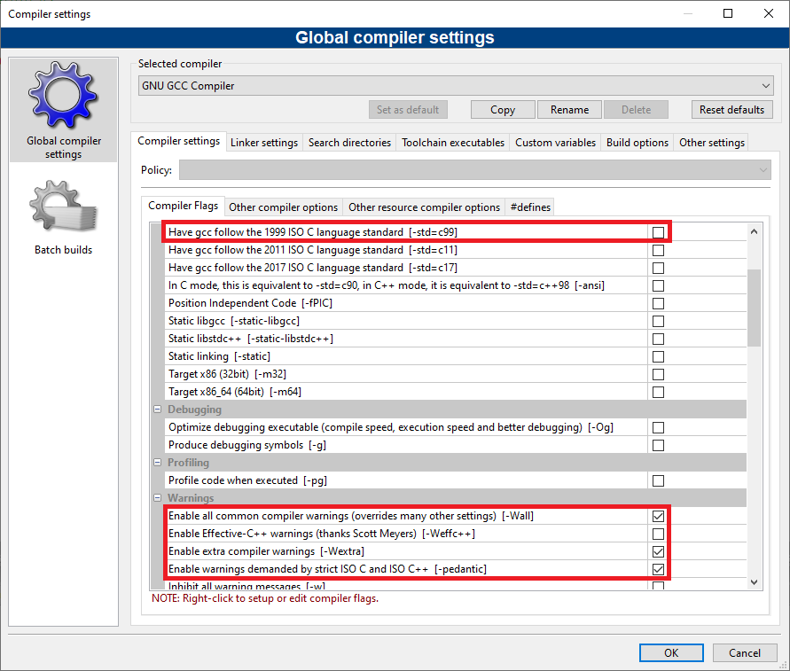
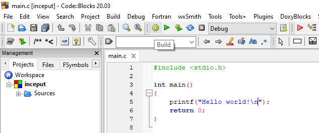
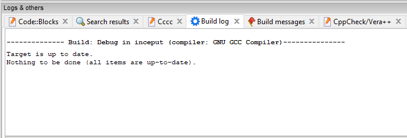
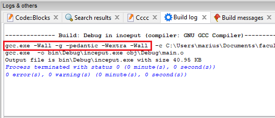

# Laboratorul 2

### ⚠ Puneți cât mai multe întrebări! Nu există întrebări greșite.
#### Semnalați orice fel de greșeli găsiți!

# Cuprins
## [Modificăm opțiunile compilatorului](#modificăm-opțiunile-compilatorului-1)
## [Programe discutate](#programe-discutate-1)
## [Exerciții](#exerciții-1)
## [Întrebări, erori și orice nu a fost acoperit deja](#întrebări-erori-diverse)
## [Resurse recomandate](#resurse-recomandate-1)

## Modificăm opțiunile compilatorului

Ne dorim să scriem cod cât mai corect. Un prim pas în acest sens este să nu ignorăm mesajele de avertisment de la compilator.

Compilatorul nu ne va ajuta dacă nu îi cerem în mod explicit asta. Primul pas este să accesăm fereastra pentru setările compilatorului:


Al doilea pas este să bifăm opțiunile dorite din rubrica `Warnings`: `-Wall`, `-Wextra` și `-pedantic`. Acel `-std=c99` este opțional.



Pasul al treilea este să salvăm aceste setări apăsând butonul `OK`.

Ultimul pas, verificăm că opțiunile chiar sunt folosite. Aici nu ne interesează să executăm programul, ci doar să îl compilăm (⚙):



Dacă în zona de mesaje vă spune că nu e nimic de compilat și că `Target is up to date`:



Adăugați și ștergeți un spațiu ca să fie modificată sursa, apoi compilați din nou (⚙):



Verificați că vă apar `-Wall`, `-Wextra` și `-pedantic`; nu contează ordinea aici.

Mie îmi apare de două ori `-Wall` pentru că este setat și la nivel de proiect, și la nivel global (implicit pentru toate proiectele). Nu este ceva grav. Despre acel `-g` vom discuta mai târziu. Este folosit pentru depanare (debugging).

---
<details>
  <summary>Detalii despre standarde</summary>
  Puteți bifa și <code>-std=c99</code> din rubrica <code>General</code>, dacă nu folosiți Windows :smile: (încă nu este implementat). Din acest punct de vedere, mai sigur este <code>-std=c90</code> pentru cod cât mai portabil.
  Standardele C11 și C17 nu sunt implementate complet de multe compilatoare.
  <br><br>
  La laborator, vom încerca să folosim doar părțile din C99 care funcționează și pe Windows. Deși pare surprinzător, lucrurile stau astfel deoarece nu prea există cerere pentru îmbunătățirile aduse în noile standarde, din motive comerciale. Microsoft nu a considerat prioritară implementarea standardelor C mai noi de C90, concentrându-se pe implementarea standardelor de C++.
  <br><br>
  <details>
    <summary>Și mai multe detalii</summary>
    Le adaug numai dacă dorește cineva.
  </details>
</details>

## Programe discutate
[Înapoi la cuprins](#cuprins)

### [Instrucțiuni decizionale (iar)](#din-nou-if)
### [Sau, în unele situații, `switch`](#switch)
### [Instrucțiuni repetitive: `for`](#for)
### [Instrucțiuni repetitive: `while`](#while)
### [Instrucțiuni repetitive: `do`...`while`](#dowhile)
### [Operații pe biți](#operații-pe-biți-1)

### Din nou `if`

Pentru a ne aminti instrucțiunea `if`, avem următorul program:
```c
#include <stdio.h>

int main()
{
    int temperatura;
    printf("Introduceti temperatura (grade Celsius): ");
    scanf("%d", &temperatura);

    if(temperatura < -20)
        puts("Prea frig!");
    else if(temperatura < -5)
        puts("Friiig!");
    else if(temperatura < 10)
        puts("Frig...");
    else if(temperatura < 25)
    {
        puts("Ideal!");
        if(temperatura > 20)
        {
            puts("Si poate e si soare!");
        }
    }
    else if(temperatura < 35)
        puts("Cald...");
    else
        puts("Prea cald!");
    return 0;
}
```
Citiți-l cu atenție pentru a înțelege ce face, apoi executați și faceți câteva modificări (dacă doriți).

Am folosit funcția `puts` în loc de `printf` deoarece nu dorim să formatăm nimic, ci doar să afișăm un mesaj simplu. De asemenea, `puts` adaugă automat `\n`.

Dacă declarăm `temperatura` de un tip de date real, programul se complică. Haideți să vedem de ce.

#### `float`, `double` sau `long double`?
Răspunsul corect este "depinde". Dacă avem nevoie de calcule cât mai precise, folosim `double` sau `long double` (sau alte biblioteci specializate, de exemplu [asta](https://github.com/creachadair/imath)). `long double` oferă o precizie cel puțin la fel de bună ca `double`. Dacă anumite condiții sunt îndeplinite, `long double` este mai precis decât `double`. Printre condițiile respective se numără un hardware adecvat, un compilator care să știe să genereze cod mașină/de asamblare special pentru acel hardware și instalarea de biblioteci corespunzătoare.

Exemple: calcule științifice, financiare.

---

Dacă nu ne interesează atât de tare un rezultat precis, dar vrem să fie efectuat mai rapid și să economisim memorie, folosim `float`.

Exemple: aplicații grafice (jocuri), rețele neuronale.

Presupunem că un byte are 8 biți. Standardul specifică 32 de biți (4 bytes) pentru fiecare `float`, 64 de biți (8 bytes) pentru fiecare `double`. Pe calculatorul meu obțin că un `long double` are 12 bytes (96 de biți):
```c
#include <stdio.h>
#include <limits.h>

int main()
{
    printf("Un `long double` ocupa %zu bytes (%zu de biti).\n", sizeof(long double), CHAR_BIT*sizeof(long double));
    return 0;
}
```
Dacă primiți warning că `z` este operator de conversie necunoscut, înlocuiți `%zu` cu `%u` sau cu `%lu`, dar `%zu` este standard.

Fun fact: [standardul](https://stackoverflow.com/questions/81656/where-do-i-find-the-current-c-or-c-standard-documents) specifică doar că un byte are `CHAR_BIT` biți (biblioteca `<limits.h>`), care este *cel puțin* 8. Desigur, de obicei un byte este exact 8 biți și poate fi numit și octet. Altfel, dacă un byte nu are 8 biți, nu prea poate fi numit octet :smiley:

#### Comparații cu `==` între numere reale în virgulă mobilă?
Nu vrem așa ceva! De ce? Pentru că nu putem reprezenta exact numerele reale.
```c
// asa NU!
if(temperatura == 100)
    puts("Fierbe apa!");

// asa da, dar DEPINDE
// precizia pe care o avem la comparatii cu numere reale
double epsilon = 1e-5;  // 10^(-5) == 0.00001
if( ((temperatura - 100) < epsilon) || ((100 - temperatura) < epsilon) )
    puts("Fierbe apa!");
```
Putem simplifica codul de mai sus eliminând din paranteze, dacă știm [ce prioritate au operatorii](https://en.cppreference.com/w/c/language/operator_precedence): `-`, `<`, `||`.

Un mod ușor (dar un pic riscant) de a reține aceste reguli este să ne gândim care e cea mai probabilă interpretare a expresiei dacă nu sunt paranteze.

De exemplu, expresia `1 + 2 * 5` este echivalentă cu `1 + (2 * 5)` (adică 11) și nu cu `(1 + 2) * 5` (adică 15), ceea ce ar trebui să știm de la matematică. Dacă vrem să evaluăm o expresie în felul al doilea (ca `(1 + 2) * 5`), trebuie să punem paranteze **obligatoriu**.

Urmând aceeași analogie, operatorii matematici (`*`, `+`, `-` etc.) au prioritate mai mare decât operatorii de comparare (`>=`, `==` etc.), iar aceștia au la rândul lor prioritate mai mare decât operatorii logici (`&&`, `||`):
```c
float epsilon = 1e-5;
if(temperatura - 100 < epsilon || 100 - temperatura < epsilon)
    puts("Fierbe apa!");
```

Sau folosim funcția [`fabs`](https://en.cppreference.com/w/c/numeric/math/fabs) din biblioteca [`<math.h>`](https://en.cppreference.com/w/c/numeric/math):
```c
float epsilon = 1e-5;
if(fabs(temperatura - 100) < epsilon)
    puts("Fierbe apa!");
```

Soluția prezentată mai sus este acceptabilă pentru ce veți face în facultate. Momentan e important doar să știți că acest subiect este unul complicat. Ca punct de plecare, puteți începe să citiți de [aici](https://floating-point-gui.de) (pentru vizualizări [aici](https://bartaz.github.io/ieee754-visualization/)), iar strict pentru comparații [aici](https://floating-point-gui.de/errors/comparison/). Desigur, lucrurile sunt complicate, dar nu e bine nici să împușcăm musca cu tunul dacă nu e cazul.

### `switch`
[Înapoi la programe](#programe-discutate-1)


### `for`
[Înapoi la programe](#programe-discutate-1)


### `while`
[Înapoi la programe](#programe-discutate-1)


### `do`...`while`
[Înapoi la programe](#programe-discutate-1)


### Operații pe biți
[Înapoi la programe](#programe-discutate-1)


## Exerciții
[Înapoi la cuprins](#cuprins)


## Întrebări, erori, diverse
[Înapoi la cuprins](#cuprins)

* 🚧

## Resurse recomandate
- [cppreference.com](https://en.cppreference.com/w/c)
- [StackOverflow](https://stackoverflow.com/questions/tagged/c?tab=Votes)
- [C FAQ](http://c-faq.com/questions.html)
- [C99 standard](http://www.open-std.org/jtc1/sc22/wg14/www/docs/n1256.pdf)


