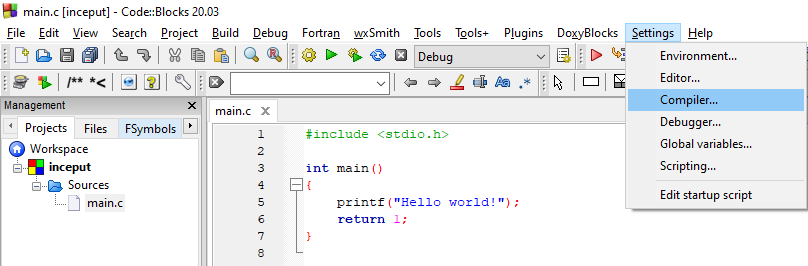
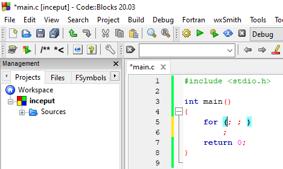

# Laboratorul 2

### ⚠ Puneți cât mai multe întrebări! Nu există întrebări greșite.
#### Semnalați orice fel de greșeli găsiți!

# Cuprins
## [Modificăm opțiunile compilatorului](#modificăm-opțiunile-compilatorului-1)
## [Programe discutate](#programe-discutate-1)
## [Exerciții](#exerciții-1)
## [Întrebări, erori și orice nu a fost acoperit deja](#întrebări-erori-diverse)
## [Resurse recomandate](#resurse-recomandate-1)

## Modificăm opțiunile compilatorului

Ne dorim să scriem cod cât mai corect. Un prim pas în acest sens este să nu ignorăm mesajele de avertisment de la compilator.

Compilatorul nu ne va ajuta dacă nu îi cerem în mod explicit asta. Primul pas este să accesăm fereastra pentru setările compilatorului:



Al doilea pas este să bifăm opțiunile dorite din rubrica `Warnings`: `-Wall`, `-Wextra` și `-pedantic`. Acel `-std=c99` este opțional.


Pasul al treilea este să salvăm aceste setări apăsând butonul `OK`.

Ultimul pas, verificăm că opțiunile chiar sunt folosite. Aici nu ne interesează să executăm programul, ci doar să îl compilăm (⚙):


Dacă în zona de mesaje vă spune că nu e nimic de compilat și că `Target is up to date`:


Adăugați și ștergeți un spațiu ca să fie modificată sursa, apoi compilați din nou (⚙):


Verificați că vă apar `-Wall`, `-Wextra` și `-pedantic`; nu contează ordinea aici.

Mie îmi apare de două ori `-Wall` pentru că este setat și la nivel de proiect, și la nivel global (implicit pentru toate proiectele). Nu este ceva grav. Despre acel `-g` vom discuta mai târziu. Este folosit pentru depanare (debugging).

---
<details>
  <summary>Detalii despre standarde</summary>
  Puteți bifa și <code>-std=c99</code> din rubrica <code>General</code>, dacă nu folosiți Windows :smile: (încă nu este implementat). Din acest punct de vedere, mai sigur este <code>-std=c90</code> pentru cod cât mai portabil.
  Standardele C11 și C17 nu sunt implementate complet de multe compilatoare.
  <br><br>
  La laborator, vom încerca să folosim doar părțile din C99 care funcționează și pe Windows. Deși pare surprinzător, lucrurile stau astfel deoarece nu prea există cerere pentru îmbunătățirile aduse în noile standarde, din motive comerciale. Microsoft nu a considerat prioritară implementarea standardelor C mai noi de C90, concentrându-se pe implementarea standardelor de C++.
  <br><br>
  <details>
    <summary>Și mai multe detalii</summary>
    Le adaug numai dacă dorește cineva.
  </details>
</details>

## Programe discutate
[Înapoi la cuprins](#cuprins)

### [Instrucțiuni decizionale (iar)](#din-nou-if)
### [Sau, în unele situații, `switch`](#switch)
### [Instrucțiuni repetitive: `for`](#for)
### [Instrucțiuni repetitive: `while`](#while)
### [Instrucțiuni repetitive: `do`...`while`](#dowhile)
### [Operații pe biți](#operații-pe-biți-1)

### Din nou `if`

Pentru a ne aminti instrucțiunea `if`, avem următorul program:
```c
#include <stdio.h>

int main()
{
    int temperatura;
    printf("Introduceti temperatura (grade Celsius): ");
    scanf("%d", &temperatura);

    if(temperatura < -20)
        puts("Prea frig!");
    else if(temperatura < -5)
        puts("Friiig!");
    else if(temperatura < 10)
        puts("Frig...");
    else if(temperatura < 25)
    {
        puts("Ideal!");
        if(temperatura > 20)
        {
            puts("Si poate e si soare!");
        }
    }
    else if(temperatura < 35)
        puts("Cald...");
    else
        puts("Prea cald!");
    return 0;
}
```
Citiți-l cu atenție pentru a înțelege ce face, apoi executați și faceți câteva modificări (dacă doriți).

Am folosit funcția `puts` în loc de `printf` deoarece nu dorim să formatăm nimic, ci doar să afișăm un mesaj simplu. De asemenea, `puts` adaugă automat `\n`.

Dacă declarăm `temperatura` de un tip de date real, programul se complică. Haideți să vedem de ce.

#### `float`, `double` sau `long double`?
Răspunsul corect este "depinde". Dacă avem nevoie de calcule cât mai precise, folosim `double` sau `long double` (sau alte biblioteci specializate, de exemplu [asta](https://github.com/creachadair/imath)). `long double` oferă o precizie cel puțin la fel de bună ca `double`. Dacă anumite condiții sunt îndeplinite, `long double` este mai precis decât `double`. Printre condițiile respective se numără un hardware adecvat, un compilator care să știe să genereze cod mașină/de asamblare special pentru acel hardware și instalarea de biblioteci corespunzătoare (a se vedea și comentariul de [aici](https://stackoverflow.com/questions/16859500)).

Exemple: calcule științifice, financiare.

---

Dacă nu ne interesează atât de tare un rezultat precis, dar vrem să fie efectuat mai rapid și să economisim memorie, folosim `float`.

Exemple: aplicații grafice (jocuri), rețele neuronale.

Presupunem că un byte are 8 biți. Standardul specifică 32 de biți (4 bytes) pentru fiecare `float`, 64 de biți (8 bytes) pentru fiecare `double`. Pe calculatorul meu obțin că un `long double` are 12 bytes (96 de biți):
```c
#include <stdio.h>
#include <limits.h>

int main()
{
    printf("Un `long double` ocupa %zu bytes (%zu de biti).\n", sizeof(long double), CHAR_BIT*sizeof(long double));
    return 0;
}
```
Dacă primiți warning că `z` este operator de conversie necunoscut, înlocuiți `%zu` cu `%u` sau cu `%lu`, dar `%zu` este standard.

Fun fact: [standardul](https://stackoverflow.com/questions/81656/where-do-i-find-the-current-c-or-c-standard-documents) specifică doar că un byte are `CHAR_BIT` biți (biblioteca `<limits.h>`), care este *cel puțin* 8. Desigur, de obicei un byte este exact 8 biți și poate fi numit și octet. Altfel, dacă un byte nu are 8 biți, nu prea poate fi numit octet :smiley:

#### Comparații cu `==` între numere reale în virgulă mobilă?
Nu vrem așa ceva! De ce? Pentru că nu putem reprezenta exact numerele reale.
```c
// asa NU!
if(temperatura == 100)
    puts("Fierbe apa!");

// asa da, dar DEPINDE
// precizia pe care o avem la comparatii cu numere reale
double epsilon = 1e-5;  // 10^(-5) == 0.00001
if( ((temperatura - 100) < epsilon) || ((100 - temperatura) < epsilon) )
    puts("Fierbe apa!");
```
Putem simplifica codul de mai sus eliminând din paranteze, dacă știm [ce prioritate au operatorii](https://en.cppreference.com/w/c/language/operator_precedence): `-`, `<`, `||`.

Un mod ușor (dar un pic riscant) de a reține aceste reguli este să ne gândim care e cea mai probabilă interpretare a expresiei dacă nu sunt paranteze.

De exemplu, expresia `1 + 2 * 5` este echivalentă cu `1 + (2 * 5)` (adică 11) și nu cu `(1 + 2) * 5` (adică 15), ceea ce ar trebui să știm de la matematică. Dacă vrem să evaluăm o expresie în felul al doilea (ca `(1 + 2) * 5`), trebuie să punem paranteze **obligatoriu**.

Urmând aceeași analogie, operatorii matematici (`*`, `+`, `-` etc.) au prioritate mai mare decât operatorii de comparare (`>=`, `==` etc.), iar aceștia au la rândul lor prioritate mai mare decât operatorii logici (`&&`, `||`):
```c
double epsilon = 1e-5;
if(temperatura - 100 < epsilon || 100 - temperatura < epsilon)
    puts("Fierbe apa!");
```

Sau folosim funcția [`fabs`](https://en.cppreference.com/w/c/numeric/math/fabs) din biblioteca [`<math.h>`](https://en.cppreference.com/w/c/numeric/math):
```c
double epsilon = 1e-5;
if(fabs(temperatura - 100) < epsilon)
    puts("Fierbe apa!");
```

Soluția prezentată mai sus este acceptabilă pentru ce veți face în facultate. Momentan e important doar să știți că acest subiect este unul complicat. Ca punct de plecare, puteți începe să citiți de [aici](https://floating-point-gui.de) (pentru vizualizări [aici](https://bartaz.github.io/ieee754-visualization/)), iar strict pentru comparații [aici](https://floating-point-gui.de/errors/comparison/). Desigur, lucrurile sunt complicate, dar nu e bine nici să împușcăm musca cu tunul dacă nu e cazul.

### `switch`
[Înapoi la programe](#programe-discutate-1)

Instrucțiunea `switch` este asemănătoare cu instrucțiunea `if` și este utilă atunci când vrem să testăm egalitatea unei variabile cu mai multe valori posibile.

Instrucțiunea `break` iese din `switch`. În caz contrar, execuția continuă pe următoarea ramură *fără verificarea condiției*. Nu trebuie să mă credeți pe cuvânt. Încercați să vedeți ce se întâmplă.

Puteți să mă corectați, nu m-am mai uitat pe hartă pentru a face următorul exemplu corect din punct de vedere "cartografic":
```c
#include <stdio.h>

int main()
{
    int km;
    puts("Ce kilometru arata borna?");
    scanf("%d", &km);
    switch(km)
    {
        case 80:
            puts("Ne apropiem de Ploiesti!");
            break;
        case 120:
            puts("Ne apropiem de Comarnic!");
            break;
        case 150:
            puts("Ne apropiem de Sinaia!");
            break;
        case 170:
            puts("Ne apropiem de Predeal!");
            break;
        default:
            puts("Nu am idee unde sunt!");
            break;
    }
    return 0;
}
```

Această instrucțiune este utilizată de obicei cu tipuri de date enumerabile ([`enum`](https://en.cppreference.com/w/c/language/enum)). Acestea reprezintă numere cu "etichete" și ne ajută să avem un cod mai ușor de înțeles și de modificat pe viitor. Am putea la fel de bine să folosim valori întregi direct în condiții, ca în programul de mai sus, însă devine dificil de urmărit dacă avem multe cazuri.

Să vedem și al doilea exemplu:
```c
#include <stdio.h>
#include <stdbool.h>

enum Moneda { RON, EUR, USD, BGN, HUF, XBT };

const char* afis_moneda(enum Moneda);  // linia 6

int main()
{
    int mon;
    enum Moneda moneda;
    double suma;
    bool schimb = true;
    printf("Introduceti suma: ");
    scanf("%lf", &suma);
    puts("In ce moneda vreti sa schimbati?");
    puts("0 - RON, 1 - EUR, 2 - USD, 3 - BGN");
    scanf("%d", &mon);
    moneda = mon;   // linia 19
    switch(moneda)
    {
        case EUR:
            suma /= 4.83;
            break;
        case USD:
            suma /= 4.16;
            break;
        case BGN:
            suma /= 2.47;
            break;
        case RON:
        default:
            schimb = false;
            puts("Nu am efectuat schimbul!");
            break;
    }
    if(schimb)
        printf("Suma dupa schimb: %.3f %s", suma, afis_moneda(moneda));  // linia 38
    return 0;
}

const char* afis_moneda(enum Moneda m)
{
    switch(m)
    {
        case RON: return "Romanian New Leu (RON)";
        case EUR: return "Euro (€)";
        case USD: return "US Dollar ($)";
        case BGN: return "Bulgarian Lev (BGN)";
        case HUF: return "Hungarian Forint (HUF)";
        case XBT: return "Bitcoin (XBT)";
        default: return "";
    }
}
```

Observații:
- spre deosebire de `if`, aici sunt întotdeauna necesare acoladele; excepția ar fi un `switch` cu un singur `case`, dar e greșit (neavând `default`) și nu prea are sens
- dacă nu acoperim toate cazurile și nu avem o ramură implicită (cu `default`), ar trebui să primim un warning de la compilator, deoarece aceasta poate semnifica o greșeală de programare
- am declarat un nou tip de date enumerabil; întrucât este un tip de date definit de noi, atunci când declarăm variabile de acest tip este necesar și cuvântul cheie `enum`: `enum Moneda moneda;`
- pentru a folosi tipul de date `bool` și constantele `true` și `false`, am inclus `<stdbool.h>` (C99); spre deosebire de C++, limbajul C nu a avut de la început `bool`; tot spre deosebire de C++, în C constantele `true` și `false` sunt de fapt numerele întregi 0 și 1
- deși variabilele de tipuri de date enumerabile trebuie să se comporte exact ca variabilele întregi și să poată fi folosite în locul acestora, nu putem citi direct o variabilă de tip enumerabil cu `scanf`; este necesară conversia explicită de la linia 19
- `op1 /= op2` este prescurtare pentru `op1 = op1 / op2`, unde `op1` și `op2` sunt niște operanzi
- atunci când declarăm o funcție (linia 6), este suficient să specificăm tipul de date al parametrilor, numele fiind opțional
  - definiția funcției `afis_moneda` (corpul cu acolade) am scris-o la sfârșitul programului pentru a avea funcția `main` la început, "în prim plan"
  - compilatorul parcurge sursa de sus în jos; dacă nu avem declarația de la linia 6 (o comentăm), vom primi eroare la linia 38 (de fapt warning), întrucât în acest punct funcția `main` nu are de unde să știe dacă funcția `afis_moneda` chiar există
  - declarația de la linia 6 este o "promisiune" că undeva în codul nostru sursă (eventual în alt fișier) avem și definiția completă a funcției

### `for`
[Înapoi la programe](#programe-discutate-1)

Forma uzuală a instrucțiunii `for` este:
```c
for(<expresie_initializare>; <expresie_conditionala>; <expresie_iteratie>)
{
    instructiuni;
}
```
`<expresie_initializare>` se execută o singură dată, la început. Apoi se verifică dacă `<expresie_conditionala>` este diferită de 0 (adică este adevărată). Cât timp expresia condițională este adevărată, este executat blocul de `instructiuni`, iar apoi este evaluată `<expresie_iteratie>`. Se continuă cu verificarea expresiei condiționale și executarea blocului de `instructiuni` și a `<expresie_iteratie>` până când `<expresie_conditionala>` devine falsă.

Acoladele pot lipsi dacă avem o singură instrucțiune.

Putem omite oricare dintre aceste 4 părți ale unei instrucțiuni `for`, însă este obligatoriu să punem ambele `;`. Dacă nu avem `instructiuni`, atunci punem fie `{}`, fie `;` după paranteza închisă de la `for`.

Pentru a înțelege această instrucțiune, să ne uităm la programul de mai jos. 
```c
#include <stdio.h>

int main()
{
    int i, nr_viteze;
    nr_viteze = 6;
    puts("Am pornit motorul\n");
    for(i = 1; i <= nr_viteze; i++)
        printf("Viteza %d\n", i);
    puts("----------");  // linia 10
    for(i = nr_viteze; i > 0; --i)
        printf("Viteza %d\n", i);
    puts("\nAm oprit motorul");
    return 0;
}
```

Observații:
- expresia `i++` este prescurtare pentru `i = i + 1` și întoarce `i`, iar `--i` este prescurtare pentru `i = i - 1` și întoarce `i - 1`
  - rezultatul expresiei nu este folosit în situația de mai sus, însă variabila `i` se modifică
  - diferența dintre operatorul prefix (`<op>i`, exemplu `++i`) și operatorul postfix (`i<op>`, exemplu `i++`) este aceea că pentru operatorul postfix este necesară o copie suplimentară pentru a reține valoarea anterioară; pentru limbajul C, este irelevant acest aspect în prezent din punctul de vedere al performanței, deoarece compilatorul face diverse optimizări
- instrucțiunea de la linia 10 este doar ca să vedem mai ușor unde se termină afișarea de la primul `for`
- putem avea mai multe atribuiri: în loc de `i = 1` putem avea `i = 1, j = 20` (presupunând că am declarat variabila `j`
- putem avea mai multe condiții: în loc de `i <= nr_viteze` putem avea `i <= nr_viteze && j > 0`
- putem avea o expresie mai complexă: în loc de `i++` putem avea `i++, j -= 3`
- putem scrie mai rapid un `for` în Code::Blocks dacă apăsăm `Ctrl`+`J` după ce apar sugestii ca mai jos


După ce apăsăm `Ctrl`+`J`, ar trebui să obținem



Este subiectiv dacă vă ajută sau mai mult vă încurcă; puteți configura aceste shortcuts ca să vă genereze implicit mai mult cod de "umplutură".

### `while`
[Înapoi la programe](#programe-discutate-1)


### `do`...`while`
[Înapoi la programe](#programe-discutate-1)


### Operații pe biți
[Înapoi la programe](#programe-discutate-1)


## Exerciții
[Înapoi la cuprins](#cuprins)


## Întrebări, erori, diverse
[Înapoi la cuprins](#cuprins)

* 🚧

## Resurse recomandate
- [cppreference.com](https://en.cppreference.com/w/c)
- [StackOverflow](https://stackoverflow.com/questions/tagged/c?tab=Votes)
- [C FAQ](http://c-faq.com/questions.html)
- [C99 standard](http://www.open-std.org/jtc1/sc22/wg14/www/docs/n1256.pdf)


