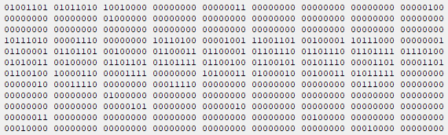

# Laboratorul 4

### ⚠ Puneți cât mai multe întrebări! Nu există întrebări greșite.
#### Semnalați orice fel de greșeli găsiți!

# Cuprins
## [Programe discutate](#programe-discutate-1)
## [Organizarea codului în fișiere separate](#organizarea-codului-în-fișiere-separate-1)
## [Exerciții](#exerciții-1)
## [Întrebări, erori și orice nu a fost acoperit deja](#întrebări-erori-diverse)
## [Resurse recomandate](#resurse-recomandate-1)

## Programe discutate
### [Structuri](#structuri-1)
### [`typedef`](#typedef-1)
### [Uniuni](#uniuni-1)
### [Câmpuri de biți](#câmpuri-de-biți-1)
### [Alocare dinamică](#alocare-dinamică-1)

### Structuri

[Structurile](https://en.cppreference.com/w/c/language/struct) reprezintă o grupare de elemente (de tipuri de date eventual eterogene, adică diferite):
```c
struct Persoana
{
    char nume[30];
    unsigned int varsta;
};
```
Vom numi `nume` și `varsta` membrii sau câmpurile structurii `struct Persoana`.

Desigur, nu este obligatoriu ca tipurile de date ale câmpurilor să fie diferite:
```c
struct punct
{
    int x, y;
};
```
Definițiile de mai sus introduc tipurile de date `struct Persoana` și `struct punct`. Declararea variabilelor se poate face la momentul definirii structurii sau ulterior:
```c
#include <stdio.h>

struct Persoana
{
    char nume[30];
    unsigned int varsta;
};

int main()
{
    struct punct
    {
        int x, y;
    } p1, p2;
    printf("Introduceti coordonatele x si y separate printr-un spatiu: ");
    scanf("%d %d", &p1.x, &p1.y);
    p2 = p1;  // copierea se face bit cu bit

    struct Persoana pers;
    printf("Introduceti numele: ");
    fgets(pers.nume, 30, stdin);  // folosim fgets deoarece numele poate contine spatii
    pers[28] = '\0';  // eliminam '\n'
    printf("Introduceti varsta: ");
    scanf("%d", &pers.varsta);
    printf("%s in varsta de %u ani se afla in punctul (%d, %d).\n", pers.nume, pers.varsta, p2.x, p2.y);
    return 0;
}
```
Observații:
- declararea unui `struct punct` nu este posibilă decât în funcția `main`
- tipul `struct Persoana` poate fi folosit și în alte funcții pentru declararea parametrilor, a variabilelor și a tipurilor de întoarcere
- trebuie să aveți grijă la copierea structurilor dacă aveți câmpuri care sunt pointeri, deoarece se va copia valoarea pointerului
  - asta înseamnă că, dacă modificăm câmpul în una dintre variabile, modificarea va fi vizibilă și în cealaltă variabilă, ceea ce nu este de dorit de obicei
  - ar trebui copiate separat valorile spre care arată acel pointer
- la copierea unor variabile de tip `struct Persoana` nu vom avea probleme, deoarece membrul `nume` are alocat spațiul (este un vector)

Structurile pot fi [inițializate](https://en.cppreference.com/w/c/language/struct_initialization) folosind sintaxa cu acolade:
```c
struct Persoana pers = { { "M M" }, 2 };
```
Dacă nu știm ordinea câmpurilor în structură (destul de posibil când folosim alte biblioteci), putem folosi următoarea sintaxă (C99):
```c
struct Persoana pers = { .varsta = 2, .nume = { "M M" } };
```

Dacă nu specificăm toate câmpurile în lista de inițializare, câmpurile lipsă vor fi inițializate cu 0, la fel ca în cazul inițializării vectorilor cu `{...}`.

Câmpurile sunt alocate în ordinea în în care au fost definite în structură, în sensul că adresa unui câmp este mai mică decât adresele câmpurilor următoare.

Adresele vor fi multiplu de `sizeof`-ul celui mai mare câmp pentru ca accesarea câmpurilor să fie făcută cât mai eficient. Din acest motiv, compilatorul are voie să introducă oricât de mulți biți consideră că sunt necesari între oricare două câmpuri și după ultimul câmp, numiți biți de aliniere (padding bits).

Avem garanția că nu există biți de aliniere înaintea primului câmp din structură.

Pentru a afla cât padding avem în cadrul unei structuri, putem folosi macro-ul [`offsetof`](https://en.cppreference.com/w/c/types/offsetof) din `<stddef.h>`, care ne spune numărul de bytes (nu numărul de biți) de la începutul unei structuri până la un anumit câmp.

Astfel, pentru structura `struct Persoana` vom observa că au fost introduși cel puțin 2 bytes de padding pentru a alinia `varsta` la multiplu de `sizeof(unsigned int)` (`unsigned int` fiind tipul de date al câmpului `varsta`), care este 4 în cazul meu: avem 30 de bytes de la `nume`, iar următorul multiplu este 32. În funcție de compilator, de platformă și de opțiunile de compilare, poate fi inserat și mai mult padding, dar ideea este să fie multiplu de `sizeof`.
```c
#include <stdio.h>
#include <stddef.h>

struct Persoana
{
    char nume[30];
    unsigned int varsta;
};

int main()
{
    printf("sizeof(struct Persoana) este %zu\n", sizeof(struct Persoana));
    printf("offset-ul membrului `nume` este %zu\n", offsetof(struct Persoana, nume));
    printf("offset-ul membrului `varsta` este %zu\n", offsetof(struct Persoana, varsta));
    return 0;
}

/*
Probabil va afișa:
sizeof(struct Persoana) este 36
offset-ul membrului `nume` este 0
offset-ul membrului `varsta` este 32
*/
```
Observații:
- pentru a economisi memorie, vom ordona membrii unei structuri în ordinea descrescătoare a `sizeof`-urilor: astfel, câmpurile care au un `sizeof` mai mic nu vor avea nevoie de multă aliniere în plus

Exemplu: să comparăm dimensiunile ocupate de următoarele structuri:
```c
// presupunem sizeof(int) == 4 și sizeof(double) == sizeof(long long) == 8
struct copac
{
    char culoare_frunze;  // 1 byte
                          // padding 3 bytes
    int nr_ramuri;        // 4 bytes
    double oxigen;        // 8 bytes
    char tip;             // 1 byte; cu frunze cazatoare, conifer
                          // padding 7 bytes
    long long frunze;     // 8 bytes
};
```
O posibilitate este să obținem `sizeof(struct copac) == 32`.

Reordonând, putem obține `sizeof(struct copac) == 24`:
```c
struct copac
{
    double oxigen;        // 8 bytes
    long long frunze;     // 8 bytes
    int nr_ramuri;        // 4 bytes
    char culoare_frunze;  // 1 byte
    char tip;             // 1 byte
                          // padding 2 bytes
};
```

Vom reveni asupra acestui aspect când vom vorbi despre [câmpuri de biți](#câmpuri-de-biți-1).

### [`typedef`](https://en.cppreference.com/w/c/language/typedef)
[Înapoi la programe](#programe-discutate-1)

Cuvântul cheie `typedef` este folosit pentru a introduce alias-uri pentru tipuri de date existente. Acesta are trei întrebuințări cu scopul comun de a simplifica lucrurile:
- introducerea structurilor (și a uniunilor) ca tipuri de date uzuale:
```c
typedef
struct punct { int x, y; }
pct;

// pentru a declara un punct:
struct punct p1;
// sau
pct p2;
```
Am scris pe rânduri separate cele 3 părți ale unei declarații `typedef`. Putem folosi același nume și pentru tipul definit cu `typedef` (puteam scrie tot `punct` în loc de `pct`) sau putem să nu mai introducem numele cu `struct`:
```c
typedef
struct {int x, y; }
punct;
// nu mai putem declara un punct folosind `struct punct`
```
- simplificarea expresiilor (vom vedea și mai târziu la pointeri la funcții); exemplul următor nu este unul tocmai bun, dar vă puteți face o idee
```c
typedef int vec[10];

vec x;  // este de fapt int x[10];
```
- oferirea unui același tip de date cu implementări diferite, specifice unei anumite configurații sau platforme

### Uniuni
[Înapoi la programe](#programe-discutate-1)

[Uniunile](https://en.cppreference.com/w/c/language/union) sunt grupări de elemente pentru care membrii sunt stocați în *aceeași* zonă de memorie. Celelalte elemente de sintaxă sunt identice cu cele de la structuri.

Excepție: nu putem inițializa decât un singur câmp al unei uniuni folosind sintaxa cu acolade. Dacă nu specificăm câmpul folosind sintaxa cu `.nume_membru` (C99), se va inițializa primul membru în ordinea în care a fost declarat în uniune.

Dimensiunea unei uniuni va fi `sizeof`-ul celui mai mare membru, la care se poate adăuga un eventual număr de biți de aliniere.

Se numește membru activ acel membru care a fost accesat sau inițializat cel mai recent. Dacă o uniune este accesată printr-un membru inactiv, valoarea reținută este reinterpretată ca tipul de date al noului tip (type punning).

Uniunile sunt utile atunci când vrem să economisim memorie sau când dorim să aflăm interpretarea unor date:
```c
#include <stdio.h>

union repr_int
{
    int nr;
    char repr[sizeof(int)];
};

int main()
{
    union repr_int var = { 0x1234567 };
    printf("Valorile fiecarui byte ale numarului %#x sunt: ", var.nr);
    for(size_t i = 0; i < sizeof(int); ++i)
        printf("%#x ", var.repr[i]);
    printf("\nUniunea are dimensiunea %zu.\n", sizeof(var));
    return 0;
}
```
Observații:
- modul de reprezentare depinde de arhitectura procesorului și este de obicei little-endian sau big-endian
  - o afișare posibilă pentru little-endian este aceasta: `Valorile fiecarui byte ale numarului 0x1234567 sunt: 0x67 0x45 0x23 0x1`
- operatorul `sizeof` este calculat la momentul compilării și nu evaluează argumentele, ci se uită doar la tipuri: `sizeof(printf("asd"))` nu va afișa nimic

### Câmpuri de biți
[Înapoi la programe](#programe-discutate-1)

[Câmpurile de biți](https://en.cppreference.com/w/c/language/bit_field) reprezintă declarații speciale ale membrilor unei structuri sau uniuni și specifică numărul de **biți** ai acelor membri. Numărul de biți va fi între zero și `sizeof`-ul membrului respectiv.

Câmpurile de biți sunt utile pentru economisirea memoriei și pentru accesarea/setarea individuală a fiecărui bit (alt exemplu [aici](https://stackoverflow.com/a/252778)):
```c
union repr_char
{
    unsigned char nibble : 4;
    struct {
        unsigned char bit1 : 1;
        unsigned char bit2 : 1;
        unsigned char bit3 : 1;
        unsigned char bit4 : 1;
    } bits;
};
```
Observații:
- o variabilă de tip `repr_char` va ocupa cel mai probabil 1 byte, deoarece va avea la sfârșit padding
- tipul membrului `bits` este o structură *anonimă*, deoarece nu are nume
  - diferența față de o structură cu nume este aceea că putem declara variabile de acest tip doar la momentul definirii
  - aceleași observații sunt valabile și pentru uniuni anonime

Deoarece adresele trebuie să fie aliniate, nu putem accesa adresa unui câmp de biți:
```c
struct test { int t : 3; } var;
// dacă încercăm să accesăm `&var.t;`, vom primi eroare la compilare: "error: cannot take address of bit-field 't'"
```

Standardul specifică faptul că putem avea câmpuri de biți pentru următoarele tipuri de date: `unsigned int`, `signed int`, `int` și `_Bool`. Alte observații:
- deși de obicei `int` înseamnă `signed int`, în cazul câmpurilor de biți poate fi un întreg cu semn sau fără semn (depinde de implementare)
- utilizarea altor tipuri de date depinde de implementare
- valoarea zero este tratată special și poate fi folosită pentru a adăuga padding în mod explicit pentru a începe un nou slot, iar membrul respectiv nu trebuie să aibă nume: `unsigned : 0;`
- `offsetof` pe un câmp de biți este UB 💥
- `sizeof` ne spune numărul de bytes: dacă încercăm să folosim acest operator pe un câmp de biți, primim eroare la compilare
- ordinea câmpurilor de biți în interiorul unui byte  depinde de platformă/procesor; ordinea este little-endian/big-endian sau altceva
- un câmp de biți de tip `_Bool` nu poate folosi mai mult de un bit
- de obicei, câmpurile de biți consecutive se vor afla în același byte, pe cât posibil; astfel, putem economisi și mai mult memorie, împreună cu ordonarea descrescătoare a membrilor structurilor

### Alocare dinamică
[Înapoi la programe](#programe-discutate-1)

În limbajul C, variabilele pot avea mai multe [clase de memorare](https://en.cppreference.com/w/c/language/storage_duration). Speficifatorii de clase de memorare stabilesc durata de viață a unei variabile și modul de linking (secțiunea următoare).

Există 4 specificatori (de fapt 5 în C11):
- `auto`
- `register`
- `static`
- `extern`

Dintre acestea 4, numai `register` poate fi specificat pentru parametrii unei funcții.

`auto` este specificatorul cel mai uzual și este considerat implicit. Înseamnă spațiu alocat automat și se referă la variabile locale, în interiorul unui bloc cu `{` și `}`:
```c
void f()
{
	int x;
	{
		float y;
		// intr-un bloc interior putem accesa variabile din blocuri exterioare
	}
	// reciproca nu este adevarata: aici nu mai putem accesa y
}
// iar aici sau in alta functie nu mai putem accesa x din functia `void f`
```
Observații:
- cuvântul cheie `auto` este permis doar pentru că limbajul C provine din [limbajul B](https://www.bell-labs.com/usr/dmr/www/kbman.html), pentru a oferi compatibilitate și pentru a traduce mai ușor programe B în programe C; limbajul B nu are tipuri de date, toate variabilele sunt `int`
- `auto int x` sau `int auto x` sau `auto x` sau `x` sunt echivalente, cu mențiunea că doar `int x` și `auto int x` respectă standardul C
- `float y` și `auto float y` sunt echivalente, dar `auto y = 1.5` convertește 1.5 la 1 și îl face întreg
- concluzia: **nu avem nevoie să folosim în mod explicit `auto`**
- printr-un abuz de limbaj frecvent folosit în sistemul de educație românesc, ne vom referi la variabilele locale ca fiind "alocate static", deși corect este "alocate automat"; în cazul variabilelor care sunt într-adevăr alocate static, declarate cu cuvântul cheie `static`, le vom spune "variabile alocate static cu `static`"
- atenție: `auto` în limbajul C++ este util, dar [face altceva](https://en.cppreference.com/w/cpp/language/auto): deducerea automată a tipului unei expresii

`register` este folosit pentru a-i cere compilatorului să aloce variabila într-un registru al procesorului, accesul fiind mult mai rapid decât în memoria RAM. Nu putem pune multe variabile în regiștri deoarece procesoarele au un număr mic de regiștri. Cererea programatorului către compilator poate fi ignorată. Deoarece variabilele declarate cu `register` nu "trăiesc" în memoria RAM, este o eroare de sintaxă să preluăm adresa unei astfel de variabile.

În prezent, `register` poate fi util doar în programarea pe [**dispozitive embedded**](https://stackoverflow.com/questions/5507715/should-i-use-the-register-keyword-in-my-code#comment32082724_5507742). În orice alte situații, mai bine **nu folosim** `register`, deoarece compilatoarele moderne (adică nu cele de acum 20-30 de ani) știu mai bine decât noi să aloce variabilele în regiștri [în majoritatea cazurilor](https://stackoverflow.com/questions/578202/register-keyword-in-c).

În limbajul C++, `register` a fost păstrat pentru compatibilitate cu limbajul C, doar că nu are vreun efect, apoi a fost complet înlăturat în 2017 (este rezervat și nu mai face nimic).

Modul de alocare static (**nu** cuvântul cheie) este modul de alocare implicit pentru variabilele globale folosite într-un singur fișier (internal linkage) sau în mai multe fișiere (external linkage). Variabilele alocate static cu `static` "trăiesc" pe tot parcursul programului și sunt inițializate înaintea apelării funcției `main`.

Cuvântul cheie `static` declară o variabilă ca fiind alocată static cu `static` și accesibilă doar din fișierul curent (internal linkage):
- dacă o *funcție* este declarată cu `static`, atunci nu este vizibilă decât în interiorul fișierului curent (mai corect, translation unit)
- dacă variabila este declarată global, este vizibilă în toate funcțiile din fișierul curent
- dacă variabila este declarată local, într-o funcție sau într-un bloc, este accesibilă doar în interiorul funcției/blocului, dar își păstrează valoarea anterioară:
```c
#include <stdio.h>

int glob1;
static int glob2;

void f()
{
	static int x = 1;
	printf("x este %d\n");
	++x;
}

int main()
{
	f();
	f();
	return 0;
}
```

## Organizarea codului în fișiere separate
[Înapoi la cuprins](#cuprins)

Pentru a putea vorbi despre compilarea mai multor fișiere, trebuie întâi să știm [ce se întâmplă](https://en.cppreference.com/w/c/language/translation_phases) atunci când compilăm un singur fișier.

De fapt, prin compilare se înțeleg de obicei mai multe etape:

1. Preprocesare
```c
#define MAXN 5
// comentariu
int main()
{
    int n = MAXN;
    return 0;
}
```
Sunt aplicate toate directivele de preprocesare, ceea ce înseamnă pe scurt că se face copy-paste în tot programul în mod recursiv până când sunt eliminate toate directivele de preprocesare:
- de exemplu, header-ul `<stdlib.h>` poate să includă header-ul `<limits.h>`, care poate include la rândul său alt header și tot așa
- macro-urile sunt și ele aplicate; mai multe despre asta în laboratorul viitor, dar, pe scurt, în programul de mai sus, peste tot unde apare `MAXN`, va fi înlocuit cu 5
- la final, toate directivele de preprocesare sunt înlocuite cu un spațiu alb; la fel și comentariile

Aplicând doar preprocesarea (opțiunea de compilator din linie de comandă ar trebui să fie `-E`, utilitarul `cc1.exe`), vom obține
```c


int main()
{
    int n = 5;
    return 0;
}
```
2. Compilarea propriu-zisă (cu opțiunea de compilator `-S`, tot `cc1.exe`): transformă codul sursă preprocesat în cod de asamblare
```s
        .file   "h.c"
        .text
        .globl  main
        .type   main, @function
main:
.LFB0:
        .cfi_startproc
        pushq   %rbp
        .cfi_def_cfa_offset 16
        .cfi_offset 6, -16
        movq    %rsp, %rbp
        .cfi_def_cfa_register 6
        movl    $5, -4(%rbp)
        movl    $0, %eax
        popq    %rbp
        .cfi_def_cfa 7, 8
        ret
        .cfi_endproc
.LFE0:
        .size   main, .-main
        .ident  "GCC: (Ubuntu 9.3.0-10ubuntu2~16.04) 9.3.0"
        .section        .note.GNU-stack,"",@progbits
```
Sau pe Windows:
```s
	.file	"h.c"
	.text
	.def	__main;	.scl	2;	.type	32;	.endef
	.globl	main
	.def	main;	.scl	2;	.type	32;	.endef
	.seh_proc	main
main:
	pushq	%rbp
	.seh_pushreg	%rbp
	movq	%rsp, %rbp
	.seh_setframe	%rbp, 0
	subq	$48, %rsp
	.seh_stackalloc	48
	.seh_endprologue
	call	__main
	movl	$5, -4(%rbp)
	movl	$0, %eax
	addq	$48, %rsp
	popq	%rbp
	ret
	.seh_endproc
	.ident	"GCC: (x86_64-win32-seh-rev0, Built by MinGW-W64 project) 8.1.0"
```
3. Asamblarea: transformă codul de asamblare în fișiere obiect (binar) cu opțiunea de compilator `-c`, utilitarul `as.exe`: o mică parte din binar pentru codul de mai sus



4. Linking (legare), utilitarul `ld` (sau `collect2.exe`): în această etapă, unul sau mai multe fișiere obiect sunt transformate într-un fișier executabil

Ca fișiere obiect, poate fi vorba și despre biblioteci. Acestea sunt de două tipuri: statice (`.lib` sau `.a`) sau dinamice (`.dll` sau `.so`). Cele statice vor fi incluse în executabil și vor crește dimensiunea acestuia. Cele dinamice pot cauza erori la execuția programului.

Atunci când organizăm codul în mai multe fișiere, vom folosi fișiere de tip header (cu extensia `.h`) pentru **declarații** și fișiere de tip sursă (cu extensia `.c`) pentru **definiții**, adică pentru implementarea propriu-zisă. Fișierele header sau alte declarații expun **ce** funcții/variabile/tipuri de date folosim din alte fișiere.

Pentru fiecare fișier care a trecut de etapa de preprocesare (numit translation unit), putem compila câte un fișier obiect separat. La final, în etapa de linking, din aceste fișiere obiect va fi obținut executabilul. Avantajul acestei abordări este că vom recompila doar fișierele modificate, iar singura etapă care se va realiza de fiecare dată va fi cea de linking.

Exemplu:
```c
// main.c
#include <stdio.h>
#include "probleme.h"

int main(void)
{
    puts("Apelez problema 1");
    problema_1();
    puts("Apelez problema 2");
    problema_2();
    puts("Gata");
    return 0;
}


// probleme.h
void problema_1(void);
void problema_2(void);


// probleme.c
#include <stdio.h>
#include "probleme.h"

void problema_1(void)
{
    puts("p1");
    /* rezolvare */
}

void problema_2(void)
{
    puts("p2");
    /* rezolvare */
}
```

Problemele apar atunci când într-un translation unit (fișier de după preprocesare) ajungem să includem același lucru de două ori fără să vrem (deoarece directivele `include` sunt procesate recursiv, până la "epuizare"). Să presupunem că în fișierul header mai definim și o structură:
```c
// main.c
#include <stdio.h>
#include "probleme.h"
#include "probleme.h"

int main(void)
{
    puts("Apelez problema 1");
    problema_1();
    puts("Apelez problema 2");
    problema_2();
    puts("Gata");
    return 0;
}


// probleme.h
void problema_1(void);
void problema_2(void);

struct Persoana
{
    int varsta;
};


// probleme.c
#include <stdio.h>
#include "probleme.h"

void problema_1(void)
{
    puts("p1");
    /* rezolvare */
}

void problema_2(void)
{
    puts("p2");
    /* rezolvare */
}
```
Ce se întâmplă?

În etapa de preprocesare, se copiază de două ori definiția structurii, deoarece se face pur și simplu copy-paste (așa funcționează directivele de preprocesare).

Din asta deducem și că ordinea în care sunt scrise macroinstrucțiunile poate să conteze.

Soluția este să includem un fișier header doar dacă nu a fost inclus deja. Fie folosim un "include guard":
```c
// probleme.h
#ifndef PROBLEME_H
#define PROBLEME_H

void problema_1(void);
void problema_2(void);

struct Persoana
{
    int varsta;
};

#endif // PROBLEME_H
```
Fie folosim o declarație `pragma`:
```c
// probleme.h
#pragma once

void problema_1(void);
void problema_2(void);

struct Persoana
{
    int varsta;
};
```
Observații:
- putem avea un singur fișier header și mai multe fișiere sursă, nu este obligatoriu să aibă același nume fișierul header cu cel sursă sau să existe o corespondență 1:1
- în fișierul `probleme.c` nu este obligatoriu să includem header-ul dacă nu folosim tipurile de date definite, dar e bine să o facem pentru a documenta codul


## Exerciții
[Înapoi la cuprins](#cuprins)


## Întrebări, erori, diverse
[Înapoi la cuprins](#cuprins)

* 🚧

## Resurse recomandate
- [cppreference.com](https://en.cppreference.com/w/c)
- [StackOverflow](https://stackoverflow.com/questions/tagged/c?tab=Votes)
- [C FAQ](http://c-faq.com/questions.html)
- [C99 standard](http://www.open-std.org/jtc1/sc22/wg14/www/docs/n1256.pdf) (doar să îl răsfoiți un pic)
