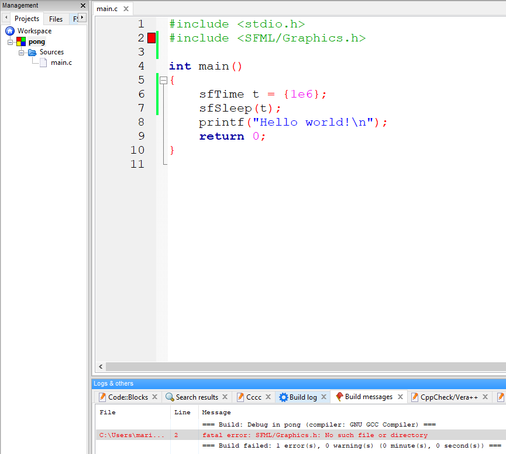
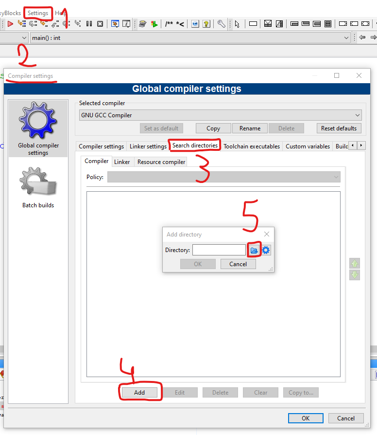
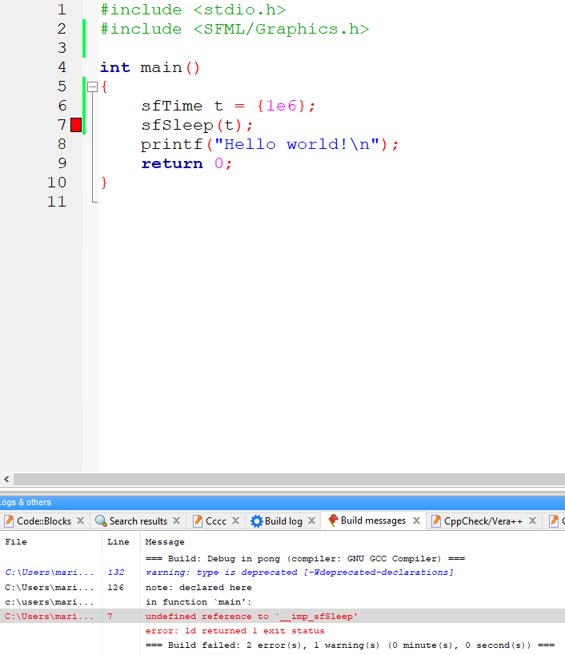
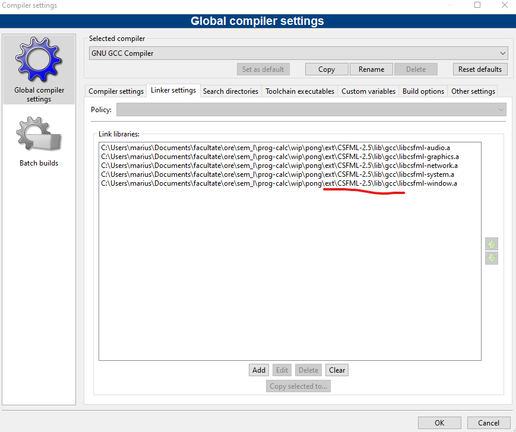

Scop: vom scrie o variantă de Pong.

### [Biblioteci externe](#biblioteci-externe-1)
### [Planificarea structurii codului](#planificarea-structurii-codului-1)
### [Implementarea](#implementarea-1)

### Biblioteci externe

Pași:
- găsirea unei biblioteci care să facă ce dorim
- compilarea bibliotecii (de multe ori necesară)
- includerea fișierelor header pentru a avea acces la interfața oferită de bibliotecă
- adăugarea căilor către fișierele header și către fișierele binare
- compilarea programului nostru și legarea (linking-ul) bibliotecilor externe
- executarea programului dacă biblioteca este legată dinamic (DLLs pe Windows, shared objects pe *nix)

-----


Pas opțional: update la o versiune [mai nouă](http://www.winlibs.com/#download-release) a compilatorului.

Pentru partea de grafică, vom încerca CSFML. Dacă nu reușim, vom încerca ulterior cu SDL. Un punct de plecare pentru a găsi diverse biblioteci este [acesta](https://github.com/oz123/awesome-c).

CSFML poate fi descărcat de [aici](https://www.sfml-dev.org/download/csfml/). Mai exact, eu voi folosi [varianta pe 64 de biți](https://www.sfml-dev.org/files/CSFML-2.5-windows-64-bit.zip). Dacă aveți un MinGW mai vechi, este posibil să aveți versiunea pe 32 de biți. Dacă nu reușim așa, vom compila codul sursă.

Vom structura proiectul în felul următor:
```
pong
├───ext
│   └───CSFML-2.5
│       ├───bin
│       ├───include
│       └───lib
├───pong.cbp
└───README.md
```

Directorul rădăcină se va numi `pong`. În directorul `ext` vom pune toate bibliotecile externe. În structura de mai sus, în folderul `CSFML-2.5` am pus ce am extras din arhiva `CSFML-2.5-windows-64-bit.zip`.

Vom face și un fișier `README.md` unde vom scrie documentația. Fișierul `.cbp` este fișierul de proiect pentru Code::Blocks. Puteți folosi orice editor doriți.

Unul dintre primii pași pe care îi facem atunci când vrem să folosim o bibliotecă externă este să scriem un program de test și să vedem dacă merge. În cazul nostru, acest program va fi următorul:
```c
#include <stdio.h>
#include <SFML/Graphics.h>

int main()
{
    sfTime t = {1e6};
    sfSleep(t);
    printf("Hello world!\n");
    return 0;
}
```
Programul "doarme" timp de o secundă, iar apoi afișează un mesaj. Dacă încercăm să compilăm, vom primi următoarea eroare:



Trebuie să îi spunem compilatorului unde găsește aceste fișiere header: `Settings`->`Compiler...`->`Search directories`->`Add`:



Calea va fi folderul `include` din folderul `CSFML-2.5` (care se află în `ext`)


După aceea, dăm pe butoanele de `ok`. Pentru a verifica dacă am pus calea corect, încercăm să compilăm. Vom primi un mesaj de eroare, însă este altă eroare 😄



Totuși, ca să verificăm ce cale a fost setată, ne putem uita pe tab-ul `Build log`. Calea este adăugată cu opțiunea `-I` (i mare urmat de nume director):


Dacă după acest pas nu primiți sugestii în editor (cu <kbd>Ctrl</kbd>+<kbd>Space</kbd>), atunci click dreapta pe proiect și `Reparse this project`.

Acum trebuie să rezolvăm eroarea cu `undefined` ceva. I-am spus compilatorului unde să găsească fișierele header, însă acelea conțin doar niște declarații. Trebuie să spunem și unde este implementarea: `Settings`->`Compiler...`->`Linker settings`->`Add`. Vom adăuga fișierele din folderul `lib` (subfolderul `gcc` deoarece folosim compilatorul GCC) din CSFML. Pentru programul demo de mai sus ar fi necesar doar `libcsfml-system`, însă pentru simplitate le vom adăuga pe toate:



⚠ Observație: în proiecte mai serioase vom adăuga numai strictul necesar!

În acest punct, compilarea va reuși. Putem să ne uităm pe `Build log` să vedem că sunt adăugate fișierele `.a` (de la archive). Totuși, dacă executăm programul, vom primi următoarea eroare:


Trebuie să copiem în folderul `bin\Debug` (creat de Code::Blocks) fișierele `.dll` din folderul `bin` din CSFML. Le copiem din File Explorer. Trebuie să fie în același director cu executabilul nostru (`pong.exe` în cazul de față).

După acest pas, lucrurile par să meargă. Dacă totuși apar probleme, o primă soluție este să compilăm noi și biblioteca externă. Dacă nici asta nu reușește, încercăm să folosim alt compilator și apoi reluăm pașii discutați. De obicei, versiunile mai noi de compilatoare au mai puține bug-uri.

⚠ Observație: pe repository-ul de pe github nu am adăugat bibliotecile externe, deoarece pot ocupa destul de mult spațiu. Le voi adăuga pentru proiectul demo final, însă aș vrea să fac asta folosind git-lfs și nu am apucat să îl configurez.

-----

`[2020-12-25]` În episodul următor vom explora ce ne oferă SFML. Sărbători fericite!

-----

### Planificarea structurii codului

Înainte să ne apucăm de implementare, trebuie să avem o idee mai clară despre ce vrem să obținem.

Chiar dacă jocul Pong este relativ simplu, este bine să fie structurat pentru a putea adăuga ușor funcționalități suplimentare. Putem identifica următoarele elemente:
- ecranul pe care se afișează toate elementele (totuși, am putea avea încă un ecran pentru meniu/scoruri)
- cei doi jucători
- mingea
- fileul
- pereții
- scorul fiecărui jucător (eventual și numele)

Funcționalități suplimentare care nu sunt atât de prioritare:
- pauză
- reținerea scorurilor
- unghiul și viteza cu care e lovită mingea influențează noua traiectorie

### Implementarea
